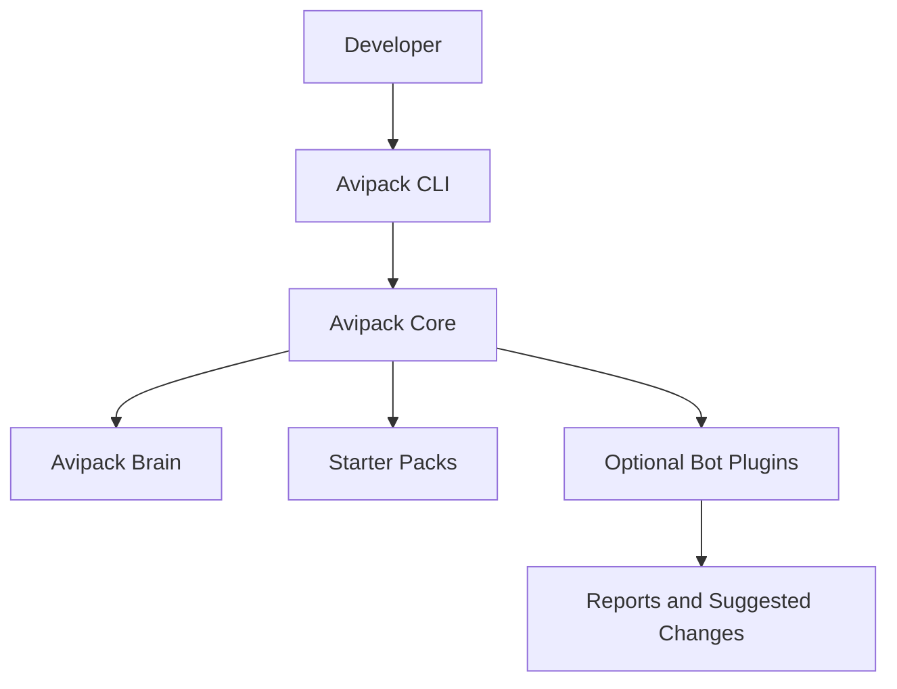

# Architecture

Avipack is a local-first TypeScript monorepo with a CLI package, core package, optional bot packages, and starter templates.

## CLI Layer

`packages/cli` owns command registration, command help, argument parsing, and user-facing output. It should not hold deep bot logic or template implementation details.

## Core Layer

`packages/core` owns reusable primitives:

- Config loading.
- Brain creation/checking.
- Existing project adoption and simple stack detection.
- Project-local bot lifecycle state and report writing.
- Change request and ADR file generation.
- Bot manifest types and registry helpers.
- Starter template registry.
- YAML validation.

## Template Layer

The MVP generic template is bundled inside `@avipack/core` under `packages/core/templates`. This lets the installed core package resolve the working `generic-brain-only` template without depending on the monorepo root.

`packages/templates` remains a workspace area for future starter-pack documentation and expansion. Future starter packs may become separate packages once template packaging and versioning need to scale.

## Adoption Flow

`avipack adopt` is implemented as core logic exposed through a thin CLI command. The core adoption flow detects simple project stack hints, copies only Avipack-owned template targets, preserves an existing README, writes adopted project metadata, and records `.avipack/reports/adoption-report.md`.

Force mode is intentionally narrow: it may refresh `.avipack/` and `avipack.config.yaml`, but it must not overwrite application source code or an existing README.

## Bot Plugin Layer

Bots live in separate packages. Each bot exports a manifest and a `run()` function. The CLI can discover and invoke bots later, but bot behavior should remain permission-scoped and explicit.

The current local MVP does not install or execute real bot package behavior. It records installed/enabled bot state in `avipack.config.yaml` and writes audit or execution reports under `.avipack/reports/bots/`. Adding and enabling bots are explicit owner actions and never trigger execution.

## Brain Files

The brain stores project state and control documents:

- Requirements.
- Architecture.
- Domain model.
- Testing strategy.
- Security rules.
- Glossary.
- ADRs.
- Change requests.
- Agent rules.
- Reports.

`avipack brain check` validates required files, YAML parsing, structured brain/config fields, duplicate IDs, bot config consistency, sprint-lock references, and trace references between requirements, architecture, tests, change requests, and ADRs. Report output is written only when explicitly requested with `--report`; machine-readable output is available with `--json`.

The v0.2 governance validation engine uses a small dependency-free validator in `@avipack/core` and emits structured validation issues with codes, severity, messages, file paths, and optional YAML paths. The generated template also includes JSON Schema files under `.avipack/schemas/` so the brain format is self-describing and can move to AJV later without changing the project data model.

## Extension Points

- Template variable substitution.
- Bot installation and enablement state.
- Permission validation.
- Conflict reports.
- CI and IDE integrations.
