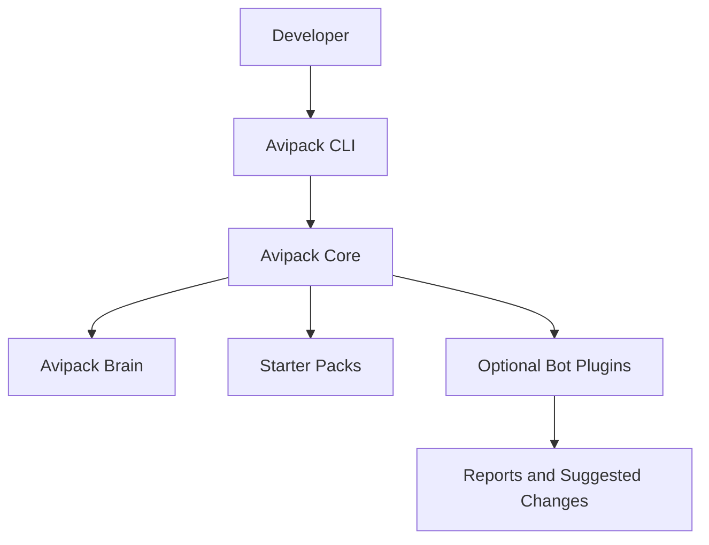

# Architecture

Avipack is a local-first TypeScript monorepo with a CLI package, core package, optional bot packages, and starter templates.

## CLI Layer

`packages/cli` owns command registration, command help, argument parsing, and user-facing output. It should not hold deep bot logic or template implementation details.

## Core Layer

`packages/core` owns reusable primitives:

- Config loading.
- Brain creation/checking.
- Bot manifest types and registry helpers.
- Starter template registry.
- YAML validation.

## Template Layer

`packages/templates` stores starter pack assets. The first complete template is `generic-brain-only`.

## Bot Plugin Layer

Bots live in separate packages. Each bot exports a manifest and a `run()` function. The CLI can discover and invoke bots later, but bot behavior should remain permission-scoped and explicit.

## Brain Files

The brain stores project state and control documents:

- Requirements.
- Architecture.
- Domain model.
- Testing strategy.
- Security rules.
- Glossary.
- ADRs.
- Change requests.
- Agent rules.
- Reports.

## Extension Points

- Template variable substitution.
- Bot installation and enablement state.
- Permission validation.
- Conflict reports.
- CI and IDE integrations.
